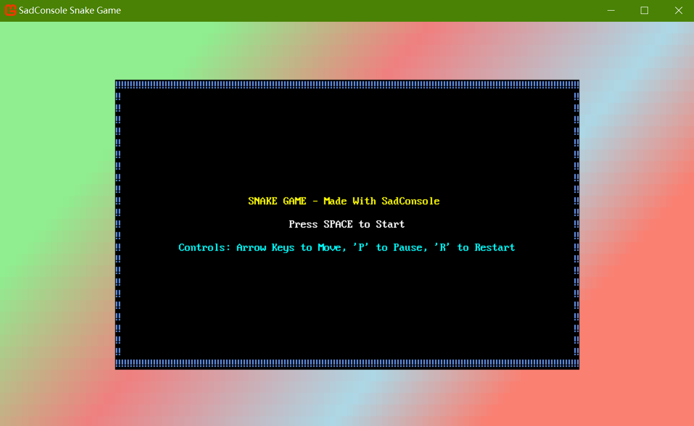
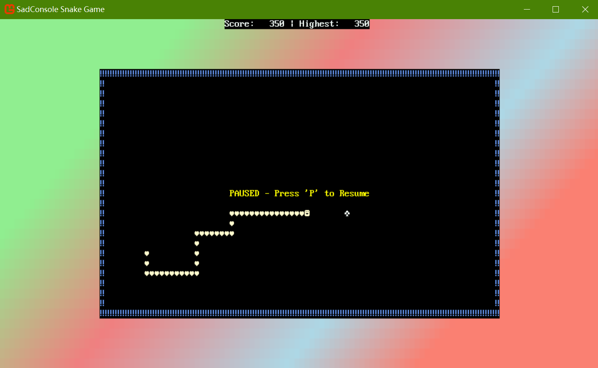

# SadConsole Snake Game (VB.NET)

## Description

This project is a modern implementation of the classic snake game, built entirely in VB.NET using the SadConsole library. The game features:

- **Classic Gameplay**: Control a growing snake, eat food, and avoid collisions
- **Progressive Difficulty**: Snake movement speed increases as your score grows
- **Multiple Game States**: Title screen, gameplay, pause menu, and game over states
- **Score Tracking**: Real-time score display with persistent high score
- **Colorful Console Graphics**: Gradient background and vibrant game elements
- **Responsive Controls**: Smooth arrow key navigation with intuitive pause/restart functionality

## Screenshots




## Installation

1. **Prerequisites**: Ensure you have [.NET SDK 10.0](https://dotnet.microsoft.com/download/dotnet/10.0) installed on your machine.

2. **Clone the Repository**:
```bash
git clone https://github.com/Pac-Dessert1436/SadConsole-Snake-Game-VB.git
cd SadConsole-Snake-Game-VB
```

3. **Build and Run**:
   - **Visual Studio 2022/2026**: Open `SadConsole Snake Game.slnx` in Visual Studio 2022/2026 and click the "Run" button
   - **Visual Studio Code**: Use the command line to build and run:
    ```bash
    dotnet build
    dotnet run
    ```

## Gameplay Instructions

- **Movement**: Use the **arrow keys** to control the snake's direction
- **Eat Food**: Collect the mint-colored food items to grow the snake and increase your score
- **Avoid Collisions**: Don't hit the walls or the snake's own body
- **Pause Game**: Press **'P'** to pause and resume gameplay
- **Restart**: Press **'R'** at any time to restart the game
- **Start Game**: Press **'Space'** on the title screen to begin playing

## Technical Features

### Game Mechanics

- **Snake Growth System**: The snake starts with 6 segments and grows by 1 segment each time it eats food
- **Adaptive Speed**: Movement delay decreases from 0.1s to 0.05s as score increases
- **Collision Detection**: Real-time collision checking with walls, food, and snake body
- **Food Spawning**: Random food placement that avoids the snake's body

### Visual Design

- **Color Scheme**: Lemon chiffon snake on a black play area with cornflower blue walls
- **Gradient Background**: Beautiful multi-color gradient fill outside the play area
- **Console Graphics**: 80x25 cell play area with clear visual distinction between game elements
- **Dynamic UI**: Score display updates in real-time at the top of the screen

### Architecture

- **Game States**: Enum-based state management (Title, Playing, Paused, GameOver)
- **Object-Oriented Design**: Separate `RootScreen`, `Snake`, and `GameGlyph` classes for modularity
- **Event-Driven Input**: Keyboard input handling with priority-based key processing
- **Frame-Independent Movement**: Time-based movement system ensures consistent gameplay across different hardware

## Personal Notes

This project serves as a practical demonstration that VB.NET is equally viable for game development as C#, especially when paired with frameworks like MonoGame and SadConsole. 

While SadConsole's official documentation is predominantly C#-centric, I found its core concepts easy to translate into VB.NET syntax, proving that the language's structural flexibility can seamlessly align with game development workflows.

For my own game development endeavors, particularly with MonoGame, I still prefer VB.NET to C# by choice. Even though I've received suggestions to focus exclusively on C#, I'm sure that VB.NET's concise, highly readable syntax not only boosts my coding productivity but also simplifies long-term code maintenance. *__Rest assured, I will switch back to C# whenever the project requirements or my own development plans call for it.__*

## License

This project is licensed under the MIT License. See the [LICENSE](LICENSE) file for details.